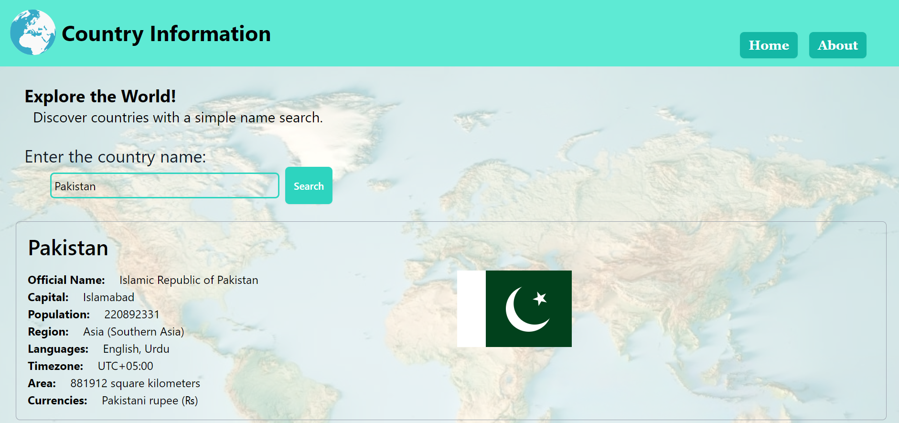

# Country Information



## Description

Country Information is a web application that allows you to retrieve information about countries worldwide by simply entering their names in a search bar. This project is built using React and Vite for a fast and efficient development experience. It leverages the power of React, Tailwind CSS, React Icons, Axios, and React Router Dom to create a responsive and user-friendly interface for exploring country data.

## Features

- **Search by Country Name:** Quickly find information about any country by entering its name into the search bar.
- **Detailed Country Information:** Access comprehensive data about a Official Name, Capital, Population, Region, Languages and more.
- **MIT License:** This project is open-source and available under the MIT License.

## Setup
```bash
npx create-vite country-information --template react
cd country-information
npm install
npm run dev
```
## Technologies Used
- React
- Vite
- Tailwind CSS
```bash
npm install -D tailwindcss postcss autoprefixer
npx tailwindcss init -p
```
- React Icons
```bash
   npm install react-icons
```
- Axios
```bash
npm install axios
```
- React Router Dom
```bash
npm install react-router-dom
```

## Data Source
The application fetches country information from the [restcountries API](https://restcountries.com/v3.1/all).

## License
This project is licensed under the MIT License. See the [LICENSE](LICENSE) file for details.